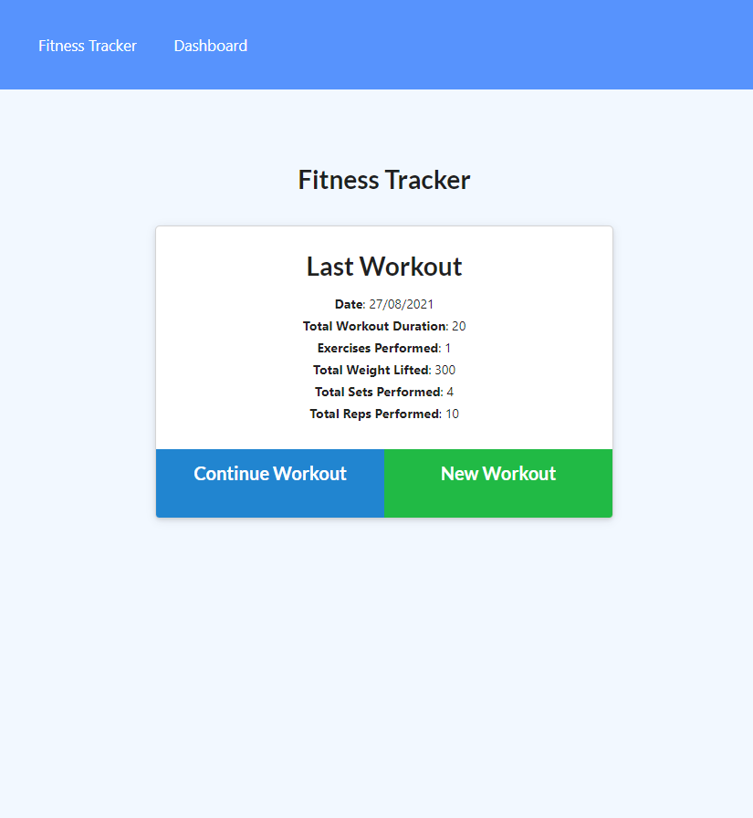
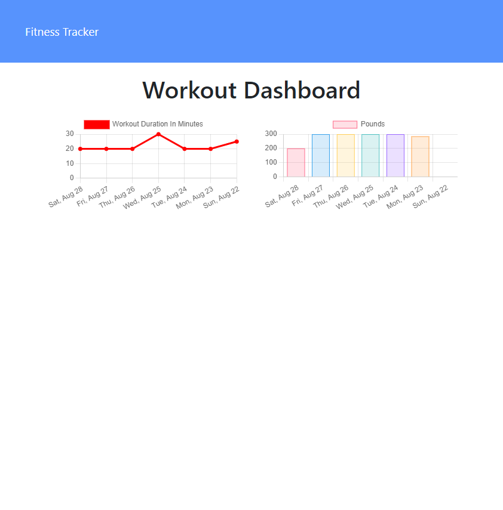

# fitness-tracker  
  
## Description
  
A workout tracker that allows users to create and track daily workouts. 

Key features include: 
- Ability to log multiple exercises in a workout on a given day
- Ability to track the name, type, weight, sets, reps and duration of exercise
- If the exercise is a cardio exercise, includes the ability to track distance travelled
   
## Table of Contents
  
  - [Installation](#installation)
  - [Usage](#usage)
  - [License](#license)
  - [Credits](#credits)
  - [Contributing](#contributing)
  - [Questions](#questions)
  - [Screenshots](#screenshot-of-deployed-application)
  
## Installation

If installing locally, run 'npm i' from the command line to install required packages.

## Usage
  
Deployed via Heroku.

If running locally, run `npm start` from the command line to start server listening then browse to localhost:3000 in a web browser. 

## Credits 

This project was completed as part of a coding bootcamp run through the University of Western Australia (UWA). Starter code for front end was provided.
  
## Contributing
  
To contribute to this project, please reach out to the creator via email (contact details below).

## Questions
  
  For any questions pertaining to this project, the developer can be reached via any of the contact methods listed below. 
  Please ensure that you include the name of this project ("readme-generator") in any communications. 

- [GitHub](https://github.com/stephje)
- [Email](mailto:s.jenkins3018@gmail.com)

## Screenshots of Deployed Application

  
  

  
